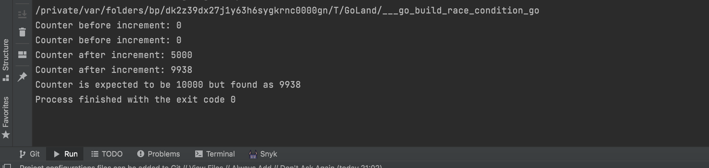
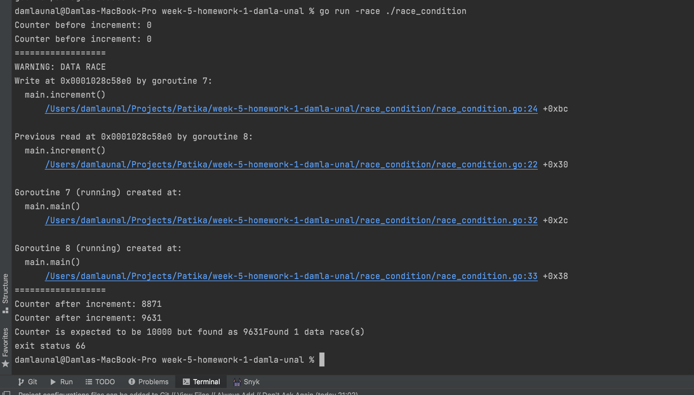

Exercise: 
- Create a sample program that simulates a race condition. So it should run fine when run sequentially but cause trouble when run in two or more goroutines.

**Race Condition** occurs when multiple threads(two or more goroutines) access and modify a shared memory area at the same time.

In race condition we get inconsistent results

A critical section is a block of code where a goroutine attempts to write a shared variable.

--------------

When you run this example (**go build race_condition.go**), you cannot see consistent result. 
Example Output:

----

If you run the code with the built-in race condition checker, the go compiler will complain about the problem.

`A small note about the Golang race condition checker: if your code occasionally accesses shared variables,
it might not be able to detect the race condition.
To detect it, the code should run in heavy load, and race conditions must be occurring.`

>> go run -race ./race_condition

	You can see the output of the race condition checker:

