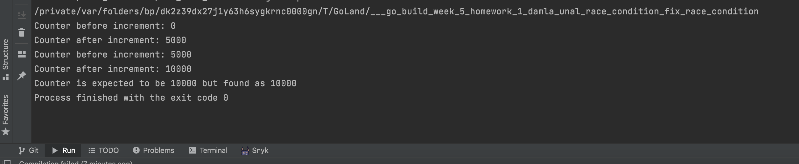
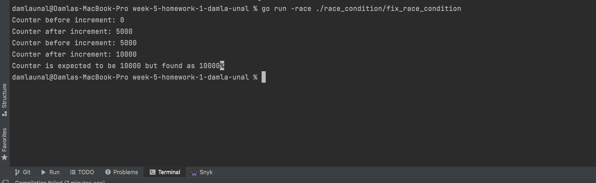

### Fixing Race Condition With Mutex

If the codes that access the shared memory area are included in the Critical Section, the same code block is run by only one thread at the same time, and thus the Race Condition is prevented.

-The cost of Critical Sections to block Race Condition is predictably performance. Therefore, lock mechanism should be used where necessary.

-Continuously entering Critical Sections to avoid Race Conditions negatively impacts performance. With the Double-checked Locking method, the Critical Section cost can be reduced for some usage scenarios.

-To solve this race condition the operations of appending numbers to the shared variable need to be atomic, the **sync.Mutex** can help us do that

----
When you run this example (**go build week-5-homework-1-damla-unal/race_condition/fix_race_condition**), you can see consistent result.

Example Output:

----

If you run the code with the built-in race condition checker, the go compiler will complain about the problem.

`A small note about the Golang race condition checker: if your code occasionally accesses shared variables,
it might not be able to detect the race condition.
To detect it, the code should run in heavy load, and race conditions must be occurring.`

>> go run -race ./race_condition/fix_race_condition

	You can see the output of the race condition checker, you’ll see that no race condition gets reported this time. 

